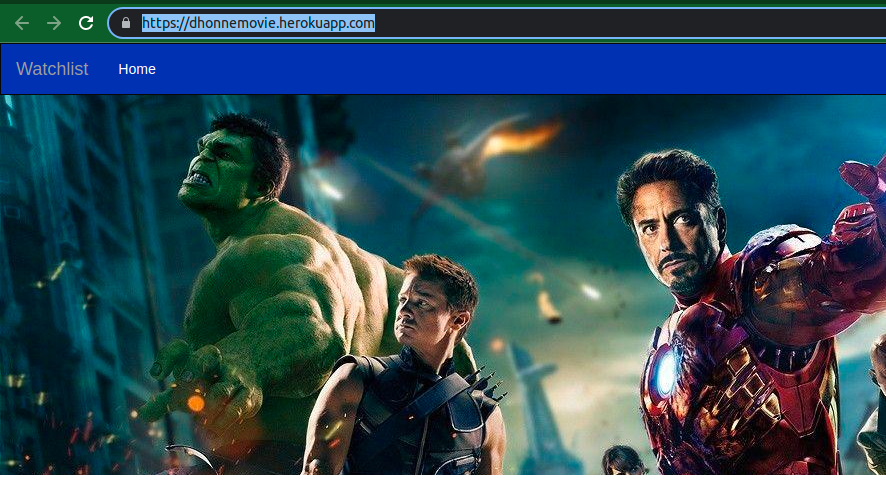
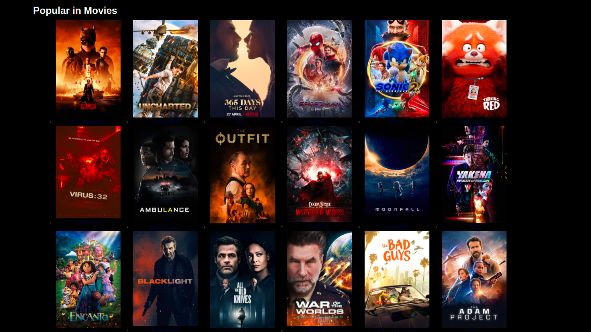
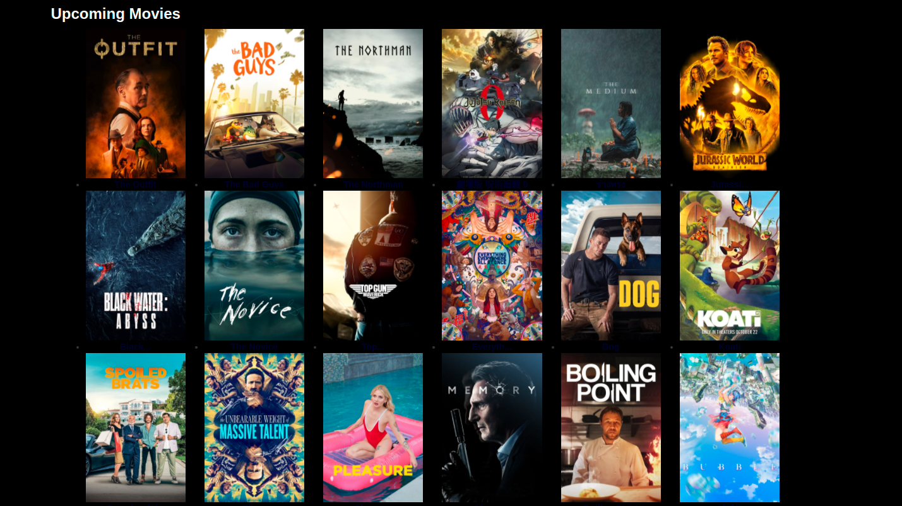
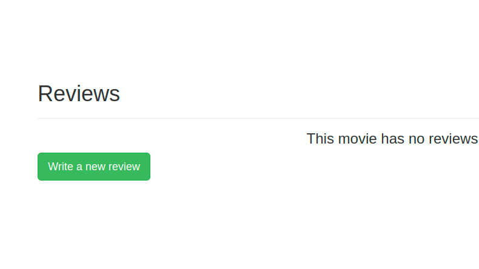

**Watchlist**  
****

## Description:

Watchlist is a web application that uses TMBD api to fetch and display movies.
 

## Live link:
 https://dhonnemovie.herokuapp.com/

## Setup/Installation Requirements

First clone the repo $ git clone https://github.com/Cencious/watchlist.git

After cloning, navigate to the project: $ cd Watchlist

On your terminal run the command:- for vs code $code . then for Atom $ atom .

Then install all the requirements through pip: $ pip install -r requirements.txt

Make the file executable: $ chmod +x start.sh

Run the application: $ ./start.sh

Now navigate to your browser at: localhost://127.0.0.15000/
 

## Project features
**Popular:**  

**Upcoming:** 

**Now showing:**

**Reviews:** 

**Technologies Used**
****

*Python3.8.10* 
*Flask2.11* 
*HTML5.1*  

## Support and contact details
Feel free to reach out via email address  kancencious@gmail.com

**License**
****
MIT License  
Copyright (c) 2022 Innoncencia Kakan/Watchlist

